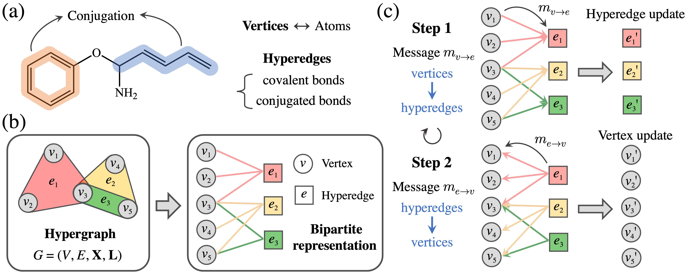

# MHNN: Molecular Hypergraph Neural Networks

[](https://arxiv.org/abs/2312.13136)
[](https://doi.org/10.1063/5.0193557)

Conventional graphs only model the pairwise connectivity in molecules, failing to adequately represent higher-order connections like multi-center bonds and conjugated structures. To tackle this challenge, we introduce molecular hypergraphs and propose Molecular Hypergraph Neural Networks (MHNN) to predict molecular optoelectronic properties, where hyperedges represent conjugated structures.



## 🚀 Environment Setup

- We'll use `conda` to install dependencies and set up the environment.
We recommend using the [Python 3.9 Miniconda installer](https://docs.conda.io/en/latest/miniconda.html#linux-installers).
- After installing `conda`, install [`mamba`](https://mamba.readthedocs.io/en/latest/) to the base environment. `mamba` is a faster, drop-in replacement for `conda`:
    ```bash
    conda install mamba -n base -c conda-forge
    ```
- Create a new environment named `mhnn` and install dependencies.
    ```bash
    mamba env create -f env.yml
    ```
- Activate the conda environment with `conda activate mhnn`.


## 📌 Datasets

| Dataset  | Graphs    | Task type  | Task number | Metric |
|:--------:|:---------:|:----------:|:-----------:|:------:|
| OPV      | 90,823    | regression | 8           | MAE    |
| OCELOTv1 | 25,251    | regression | 15          | MAE    |
| PCQM4Mv2 | 3,746,620 | regression | 1           | MAE    |


### OPV
The [OPV](https://doi.org/10.1063/1.5099132) dataset, named organic photovoltaic dataset, contains 90,823 unique molecules (monomers and soluble small molecules) and their SMILES strings, 3D geometries, and optoelectronic properties from DFT calculations. OPV has four molecular tasks, the energy of highest occupied molecular orbital for the monomer ($\varepsilon_{\rm HOMO}$), the lowest unoccupied molecular orbital of the monomer ($\varepsilon_{\rm LUMO}$), the first excitation energy of the monomer calculated with time-dependent DFT ($\Delta \varepsilon$), and the spectral overlap $I_{overlap}$. In addition, OPV has four polymeric tasks, the polymer $\varepsilon_{\rm HOMO}$, polymer $\varepsilon_{\rm LUMO}$, polymer gap $\Delta \varepsilon$, and optical LUMO $O_{\rm LUMO}$.


### OCELOTv1
The [OCELOTv1](https://doi.org/10.1039/D2SC04676H) dataset contains 25,251 organic $\pi$-conjugated molecules and their electronic, redox, and optical properties computed with the high accuracy DFT/TDDFT calculations. The DFT and TDDFT properties available in the dataset are vertical (VIE) and adiabatic (AIE) ionization energies, vertical (VEA) and adiabatic (AEA) electron affinities, cation (CR) and anion (AR) relaxation energies, HOMO energies (HOMO), LUMO energies (LUMO), HOMO–LUMO energy gaps (H–L), electron (ER) and hole (HR) reorganization energies, and lowest-lying singlet (S0S1) and triplet (S0T1) excitation energies. 

### PCQM4Mv2
[PCQM4Mv2](https://ogb.stanford.edu/docs/lsc/pcqm4mv2/) is a quantum chemistry dataset originally curated under the [PubChemQC project](https://doi.org/10.1021/acs.jcim.7b00083). A meaningful ML task was defined to predict DFT-calculated HOMO-LUMO energy gap of molecules given their 2D molecular graphs. PCQM4Mv2 is unprecedentedly large (> 3.8M graphs) in scale comparing to other labeled graph-level prediction datasets.

## 🔥 Model Training

### OPV
1. We provide training scripts for `MHNN` and `baselines` under [`scripts/opv`](scripts/opv).
For example, we can train `MHNN` for one task by running:

    ```bash
    bash scripts/opv/mhnn.sh [TASK_ID]
    ```
2. Train a model for all tasks by running:

    ```bash
    bash scripts/opv/run_all_tasks.sh [MODEL_NAME]
    ```
3. The OPV dataset will be downloaded automatically at the first time of training.
4. The model names and task ID for different tasks can be found [here](scripts/opv/run_all_tasks.sh).

### OCELOTv1
1. We provide training scripts for `MHNN` under [`scripts/ocelot`](scripts/ocelot). For example, we can train `MHNN` for one task by running:

    ```bash
    bash scripts/ocelot/train.sh [TASK_ID]
    ```
2. Train `MHNN` for all tasks by running:

    ```bash
    bash scripts/ocelot/run_all_tasks.sh
    ```
3. The ocelot dataset will be downloaded automatically at the first time of training.
4. Task ID for different tasks can be found [here](scripts/ocelot/run_all_tasks.sh).

### PCQM4Mv2
1. We provide a training script for `MHNN` under [`scripts/pcqm4mv2`](scripts/pcqm4mv2) to train `MHNN` by running:

    ```bash
    bash scripts/pcqm4mv2/train.sh
    ```
2. The PCQM4Mv2 dataset will be downloaded automatically at the first time of training.

## 🌈 Acknowledgements
This work was supported as part of NCCR Catalysis (grant number 180544), a National Centre of Competence in Research funded by the Swiss National Science Foundation.

## 📝 Citation
If you find our work useful, please consider citing it:
```bibtex
@article{chen2024molecular,
    author = {Chen, Junwu and Schwaller, Philippe},
    title = "{Molecular hypergraph neural networks}",
    journal = {The Journal of Chemical Physics},
    volume = {160},
    number = {14},
    pages = {144307},
    year = {2024},
    doi = {10.1063/5.0193557},
    url = {https://doi.org/10.1063/5.0193557},
}

```

## 📫 Contact
If you have any question, welcome to contact me at:

Junwu Chen: junwu.chen@epfl.ch